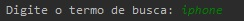
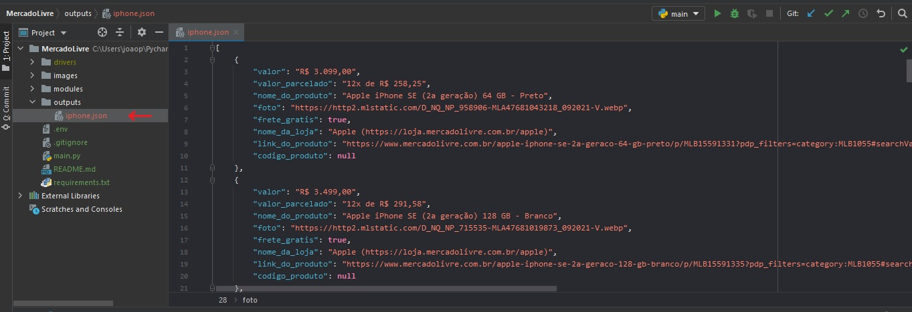
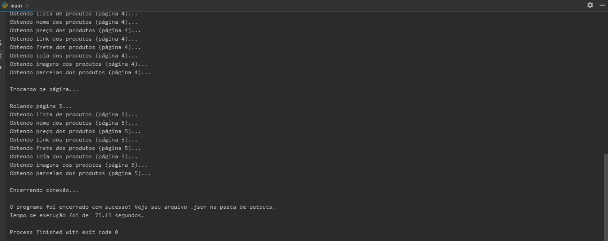

# Web Crawler Mercado Livre

Esse projeto foi feito com o objetivo de
coletar os principais dados dos produtos retornados pelas 5 primeiras páginas
do site do [Mercado Livre](https://www.mercadolivre.com.br/) a partir de um 
determinado input.

## Configuração

1. Chrome Driver: para rodar o programa é necessário
ter instalado o [Chrome Driver](https://chromedriver.chromium.org/downloads) 
na sua máquina. É importante instalar a [versão](https://www.youtube.com/watch?v=GD-lt9tchkQ) 
correspondente ao seu navegador.

2. Arquivo `.env`: para rodar o programa é necessário criar um 
arquivo de variáveis de ambiente. Apenas uma variável será inicializada
por lá (DRIVER_PATH='caminho_para_chrome_driver') e depois será chamada
na linha 15 de [main.py](main.py).

3. Plugin para `.env`: um plugin está instalado no PyCharm do
principal contribuidor (https://plugins.jetbrains.com/plugin/7861-envfile).
Se estiver usando outra IDE outros plugins serão aplicáveis.

4. "Ativar" `.env`: caso esteja usando o PyCharm e tenha o plugin
instalado é necessário seguir as [instruções](https://github.com/Ashald/EnvFile) da sessão 
USAGE do `README.md`. Se estiver usando outra IDE outros plugins serão aplicáveis.

5. O projeto foi feito na versão **3.9** do [Python](https://www.python.org/downloads/)
e por esse motivo não é possível assegurar compatibilidade com outras versões.
Para verificar a versão instalada na máquina é possível rodar o seguinte comando
no terminal: ```python --version```.

6. O [PIP](https://pypi.org/project/pip/) também deverá estar instalado.

7. Arquivo `requirements.txt`: se toda a configuração acima estiver feita será
necessário instalar as dependências listadas no arquivo [requirements.txt](requirements.txt).
Essa etapa pode ser concluída de forma fácil com o seguinte comando: `pip install -r requirements.txt`.
Também é possível instalar as dependências através de plugins como [Requirements](https://plugins.jetbrains.com/plugin/10837-requirements).


## Funcionamento

1. Input: o usuário terá a possibilidade de buscar o nome de qualquer produto
via terminal, assim como a seguinte figura. 

2. Output: os arquivos de output ficarão na pasta [outputs](./outputs). A imagem seguinte
mostra o exemplo de output para o input acima. 

3. Será possível acompanhar o andamento do programa com alguns prints de log, como 
sugere a imagem. 

## Observações importantes

1. O atributo requisitado referente ao `código do produto` não foi encontrado
e por esse motivo todos os produtos possuem esse atributo `None (null)`.

2. Algumas pesquisas não retornam lista de produtos, mas sim uma página
inteira dedicada ao produto. Isso acontece por exemplo quando buscamos por
[playstation](https://www.mercadolivre.com.br/a/store/playstation#variant_sparkle/mlb-mktp-q-r-playstation=12320).
Nesses casos o programa avisa que se trata de uma página de loja e interrompe sua execução.

3. A pasta [outputs](./outputs) possui dois exemplos de arquivos .json 
obtidos para duas entradas diferentes (iphone e pelucia). Dessa forma o funcionamento
do código pode ser melhor compreendido.

4. As linhas 18 e 19 de [main.py](main.py) se referem as configurações do
navegador. Caso queira ter a experiência visual do código só é necessário
comentar a linha 18.

5. O **tempo de execução** está totalmente relacionado aos blocos de sleep.
A função [scroll()](./modules/mercado_livre.py) possui por padrão um sleep de .2 segundos. Essa função
é de fundamental uso para que as imagens dos produtos sejam carregadas.
Acredito que esse tempo possa ser modificado de acordo com a velocidade da internet.
Dessa forma, se estiver obtendo imagens codificadas em base 64 é necessário aumentar
o tempo de sleep e caso tudo esteja ocorrendo sem anomalias pode-se tentar diminuir
esse intervalo. O mesmo vale para a linha 33 de [main.py](main.py).

